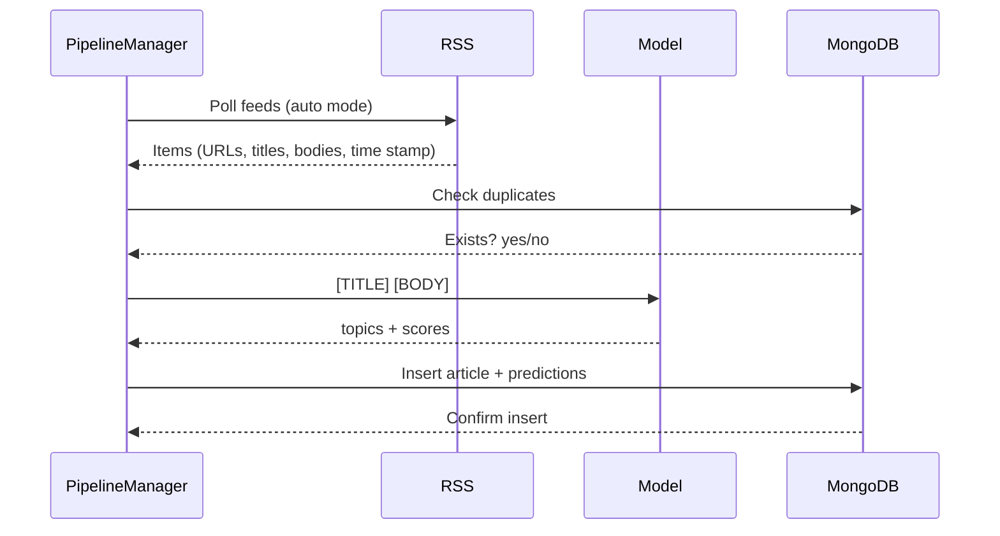

# Full-Article Topic Classification + Live News Scraper

A machine learning pipeline that parses rss feeds for economic, commodities, and macro-financial news, predicts their main subject using a  DistilBERT fine-tuning strategy (trained on reuters 21578 data set), and stores live-scraped article information plus topic predictions in MongoDB. 

---

## Project Overview

This project has two big parts:

1. **Model pipeline**  
   - Phase 1: Fine-tune **DistilBERT-base-uncased** on **reuters 21578 data set** to learn topic structure.  

2. **Live news scraping + classification system**  
   - Poll RSS feeds on a schedule, classify all new articles, and store everything in MongoDB.

The final system serves as a foundation for a real-time economic and commodities news intelligence engine, specializing in macro-financial topics such as energy markets, metals, agriculture, currency movements, and key economic indicators. Future extensions may include long-context transformers (e.g., Longformer) or adaptive topic discovery for emerging market events.

---

## Design

### High-level data flow

- **Inference (auto rss)**  
  RSS feeds → Clean text → Model → Predicted topics → MongoDB (scheduled)



## Mongodb schema

```
{
  "_id": "ObjectId",
  "url": "string",
  "title": "string",
  "body": "string",
  "published": "datetime",
  "main_topic": "string",
  "topic_score": ["float"],
  "ingested_at": "datetime"
}
```

## Project structure

```
News-Topic-Classification/
├── config.yaml                 # Global config (RSS feeds, model paths, scraping rules)
├── requirements.txt            # Reproducible environment dependencies
├── .env                        # MongoDB credentials and runtime environment variables
├── TimeLog.md                  # Work/time tracking for project deliverables
│
├── models/
│   └── bert_reuters21578/      # DistilBERT fine-tuned on economic & commodity topics
│
├── scripts/                    # Developer utility scripts
│   ├── classify_article_text.py   # CLI tool: classify a title + body into economic labels
│   └── rss_test.py               # Tests RSS ingestion and feed health
│
└── src/                         # Core application modules
    ├── db/
    │   ├── __init__.py
    │   └── mongo_client.py      # MongoDB connection (stores articles + topic predictions)
    │
    ├── inference/
    │   ├── __init__.py
    │   └── inference.py         # Loads model + runs topic prediction on text/articles
    │
    ├── pipeline/
    │   ├── __init__.py
    │   └── pipeline_manager.py  # Orchestrates RSS ingest → clean text → inference → DB write
    │
    ├── scraping/
    │   ├── __init__.py
    │   ├── clean_text.py        # Text extraction, HTML stripping, noise removal
    │   └── rss_poll.py          # Polls financial RSS feeds and extracts new article entries
    │
    ├── training/
    │   ├── __init__.py
    │   └── train_reuters21578.ipynb   # Training notebook for your custom 49-label classifier
    │
    ├── utils/
    │   ├── __init__.py
    │   └── config_loader.py     # Loads config.yaml and resolves project paths
    │
    └── __init__.py              # Marks src/ as an importable package


```

## Technologies

- **Python**
- **Hugging Face Transformers + Datasets**
- **PyTorch**
- **scikit-learn**
- **feedparser** (RSS)
- **newspaper3k / BeautifulSoup** (HTML extraction)
- **MongoDB / Atlas**

---

##  Core Concepts

- Transformer fine-tuning (**DistilBERT**)
- Multi-label topic classification (**Reuters codes**)
- News subject taxonomy (monetary policy, energy, defense, etc.)
- RSS Ingestion of Market-Moving Sources
- NoSQL document storage (**MongoDB**)
- Production-Ready Inference Pipeline

---


## DistilBERT Model(s)
Goal: Train a **topic-aware DistilBERT**

I initially fine-tuned a DistilBERT model on the 20 Newsgroups dataset with the intention of using it as the primary classifier for basic news, but later shifted the project toward a more specific economic/ commodities news. The 20NG model ultimately served as a foundational model for training the final Reuters-21578 economic and commodities classifier.


### **20NG distilBERT model results:**

**Loss and accuracy per epoch:**
   
      | Epoch | Eval Loss | Accuracy | Macro F1 |
      | ----- | --------- | -------- | -------- |
      | **1** | **1.056** | 0.680    | 0.653    |
      | **2** | **1.038** | 0.702    | 0.686    |
      | **3** | **1.053** | 0.714    | 0.702    |
      
**Best & Worst Performing Categories:**
   
      | Rank  | Category             | F1-Score |
      | ----- | -------------------- | -------- |
      | **1** | `rec.sport.hockey`   | **0.90** |
      | **2** | `rec.sport.baseball` | **0.86** |
      | **3** | `misc.forsale`       | **0.83** |
      
      | Rank          | Category             | F1-Score |
      | ------------- | -------------------- | -------- |
      | **1 (Worst)** | `talk.religion.misc` | **0.31** |
      | **2**         | `alt.atheism`        | **0.49** |
      | **3**         | `talk.politics.misc` | **0.51** |
      
      
**Training performance:**
   
      | Metric                  | Value                            |
      | ----------------------- | -------------------------------- |
      | **Total Training Time** | **(~14.3 hours)** |
      | **Training Throughput** | 0.041 steps/sec                  |
      | **Samples/sec**         | 0.658 samples/sec                |


### **Reuters21578 Results:**

**Loss and accuracy per epoch**

      | Epoch     | Eval Loss  | Accuracy   | Macro F1   |
      | --------- | ---------- | ---------- | ---------- |
      | **Final** | **0.5787** | **0.8548** | **0.4621** |

**Best & Worst Performing Categories**

      | Rank  | Category  | F1-Score  |
      | ----- | --------- | --------- |
      | **1** | `housing` | **1.000** |
      | **2** | `sugar`   | **0.957** |
      | **3** | `earn`    | **0.951** |

      | Rank          | Category | F1-Score  |
      | ------------- | -------- | --------- |
      | **1 (Worst)** | `wpi`    | **0.000** |
      | **2**         | `yen`    | **0.000** |
      | **3**         | `zinc`   | **0.000** |

**Training performance**

      | Metric                  | Value                                 |
      | ----------------------- | ------------------------------------- |
      | **Total Training Time** | ~40 seconds per epoch *(≈120s total)* |
      | **Training Throughput** | ~32 steps/sec                         |
      | **Samples/sec**         | ~510 samples/sec                      |


---

# RSS Ingestion, Filtering, and Classification Pipeline

The project includes a production-ready RSS ingestion system that polls multiple financial and commodity-focused news feeds, cleans and filters entries, classifies them using the Reuters-trained DistilBERT model, and stores structured results in MongoDB. The full pipeline is orchestrated by `pipeline_manager.py`.

## 1. Fetching RSS Feeds
Using `feedparser`, the system loads all sources defined in `config.yaml`.
Each feed is parsed entry-by-entry, with the following extracted:

- Title
- Description / HTML body
- URL
- Published timestamp (normalized to America/Denver)
- Source name

## 2. HTML Cleaning and Text Normalization
Each RSS description is cleaned via:

- BeautifulSoup stripping of HTML tags
- Removal of boilerplate (“newsletter”, “subscribe”)
- Suppression of malformed HTML warnings
- Normalized plain text output

## 3. Filtering Unwanted or Irrelevant Items
The unified filter (`should_filter_entry`) removes:

- Non-economic content (sports, lifestyle, opinion pieces)
- Marketing items
- Low-signal or boilerplate content
- Short/non-informative descriptions

## 4. Deduplication with MongoDB
Each article URL is checked with `article_exists(url)`.

- Already processed → skipped
- New items → classification

## 5. Topic Classification
New articles are classified by DistilBERT into 49 macro‑financial and commodity labels. The highest probability label becomes the article’s `main_topic`.

| **Macroeconomic Indicators** | **Currency & Financial Markets** | **Energy & Petrochemicals** | **Metals & Minerals** | **Agriculture & Livestock** |
| ---------------------------- | -------------------------------- | --------------------------- | --------------------- | --------------------------- |
| cpi                          | US-dollar                        | crude-oil                   | gold                  | grain                       |
| gnp                          | earnings                         | nat-gas                     | silver                | wheat                       |
| income                       | acquisitions/mergers             | gas                         | copper                | oilseed                     |
| interest                     | trade                            | fuel                        | aluminum              | veg-oil                     |
| ipi                          | reserves                         | heat                        | zinc                  | cocoa                       |
| jobs                         | retail                           | Petrochemicals              | tin                   | coffee                      |
| lei                          | shipping                         |                             | lead                  | cotton                      |
| money-foreign                |                                  |                             | iron-steel            | orange                      |
| money-supply                 |                                  |                             | strategic-metal       | sugar                       |
| balance-of-payments          |                                  |                             |                       | meat                        |
| wpi                          |                                  |                             |                       | hog                         |
| housing                      |                                  |                             |                       | livestock                   |
|                              |                                  |                             |                       | meal-feed                   |
|                              |                                  |                             |                       | lumber                      |
|                              |                                  |                             |                       | rubber                      |


## 6. Database Storage
Stored fields:

- URL
- Title
- Cleaned body
- Timestamp
- Main topic
- Topic confidence score

## 7. Summary Reporting
The pipeline outputs counts of:
- Saved articles
- Duplicate skips
- Optional detailed classification logs

---

## Optional Future Upgrade

Extend classifier with open-label or unsupervised discovery using to lable on novel catagories

- Embedding + Clustering – Group unlabeled articles by similarity using BERT embeddings + KMeans or UMAP

- Use as fallback when main classifier confidence is low or new topics emerge

- Store results alongside predicted topics in MongoDB for hybrid analysis

- Look into pipeline("zero-shot-classification") and AutoModel.from_pretrained(...) for implementation.

---


## Project requirments:

### 1. Core Project Requirements
- Must involve **deep learning** as the primary technical challenge.
- Must include **reads and writes to data** (database, ingestion pipeline, API storage, etc.).
- Must require **30–40 hours of effort**.
  - Max **5 hrs** research/reading.
  - Max **10 hrs** prep (data cleaning, setup).
  - At least **20 hrs** designing, building, debugging, testing deep learning models (not counting training time).
- Must be personally interesting, meaningful, resume-worthy.
  
### 2. Initial Deliverables (GitHub Markdown File)
- **Project purpose + goals** (1–3 sentences, with optional pictures).
- **ERD sketch** (entities + relationships).
- **System design sketch** (components + arrows showing interactions).
- **Daily goals/milestones** until end of class.
- **Optional UX sketches**.
- Must be submitted as a **public GitHub repo markdown link**.

### 3. Final Deliverables
#### A. GitHub Repo
- Initial pitch  
- Initial design  
- Progress log (hour-by-hour time entries)  
- Code  
- Diagrams  
- Demo (video/gif/images)  
- Final markdown report  

#### B. Class Requirements
- In-class **pitch**.
- Give **feedback** to others.
- **Final presentation** (3–10 minutes) including:
  - System demo or prototype  
  - Why it interests you  
  - Summary (1–3 sentences)  
  - Key learnings (≥3)  
  - Architecture + scaling diagram  
  - Notes on failover/performance/auth/concurrency if applicable  
  - Invite questions  

#### C. Class Channel Post
- Few sentences describing project  
- Why it interests you  
- Repo link  
- Demo gif/video  
- State **“yes, share”** or **“no, don’t share”**

#### D. Final PDF Writeup (≤3 pages)
**1–2 pages:**
- Problem description  
- Dataset description + EDA  
- Technical approach  
- Model architecture + training details  
- Train/test split  
- Metrics + results  
- Overfitting analysis  
- Iterations & improvements  
- Whether the project succeeded or made progress  

**1 page:**
- **Time log** with daily entries

### 4. Grading
- **20%** = number of hours (hours / 30)  
- **5%** = report quality  
- Project is graded on **effort**, not success.

### 5. Required Questions to Answer in Report
- Where did the data come from? Who cares about it?
- What type of problem is it (classification/regression/etc.)?
- Supervised or unsupervised?
- What prior work exists?
- What did your EDA reveal?
- What model did you use and why?
- Parameters, optimizer, pretrained weights, topology decisions.
- How data was split (train/test).
- Final performance metrics.
- Evidence of overfitting or generalization.
- What changed during iterative development?
- Did you solve the problem or make measurable progress?


