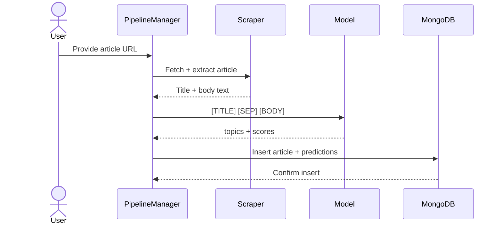
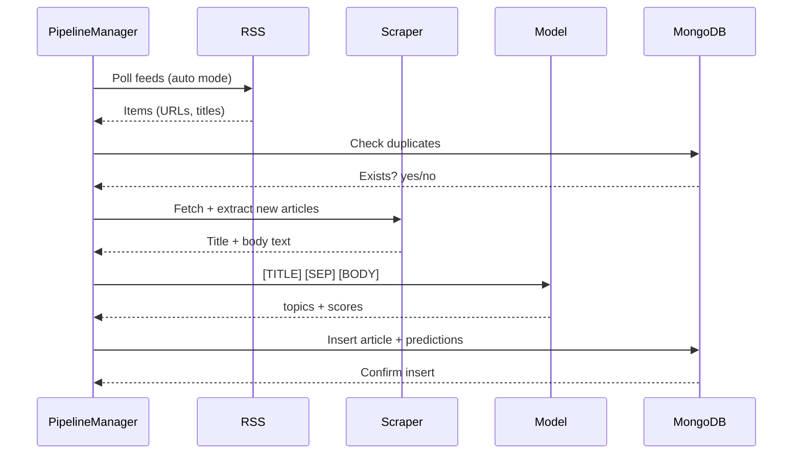

# Full-Article Topic Classification + Live News Scraper

A machine learning pipeline that reads full news articles, predicts their main subject using a two-phase DistilBERT fine-tuning strategy (20 Newsgroups → Reuters RCV1-v2), and stores live-scraped articles plus topic predictions in MongoDB. The system supports both single-URL classification and scheduled RSS scraping with an easy on/off switch.

---

## Project Overview

This project has two big parts:

1. **Model pipeline**  
   - Phase 1: Fine-tune **DistilBERT-base-uncased** on **20 Newsgroups** to learn general topic structure.  
   - Phase 2: Fine-tune that model on **Reuters RCV1-v2** to learn detailed news subjects (economics, military, energy, etc.).

2. **Live news scraping + classification system**  
   - **Manual mode**: Take a single news URL, scrape it, classify, and store the result.  
   - **Auto mode**: Poll RSS feeds on a schedule, classify all new articles, and store everything in MongoDB.

The final system becomes a foundation for a real-time **news topic intelligence** engine, with optional future upgrade to long-context models (e.g., Longformer).

---

## Design

### High-level data flow

- **Training time**  
  20NG → DistilBERT → Reuters → Final topic-classification model

- **Inference time (manual mode)**  
  URL → HTML → Clean text → Model → Predicted topics → MongoDB

- **Inference time (auto mode)**  
  RSS feeds → URLs → HTML → Clean text → Model → Predicted topics → MongoDB (scheduled)

### Manual Mode, user provided url

### Auto Mode, rss powered 

## Technologies

- **Python**
- **Hugging Face Transformers + Datasets**
- **PyTorch**
- **scikit-learn**
- **feedparser** (RSS)
- **newspaper3k / BeautifulSoup** (HTML extraction)
- **MongoDB / Atlas**
- **Cron / Docker** (scheduling)
- **Optional:** Celery + Redis (task queues), Longformer (long-context upgrade)

---

##  Core Concepts

- Transformer fine-tuning (**DistilBERT**)
- Multi-label topic classification (**Reuters codes**)
- News subject taxonomy (monetary policy, energy, defense, etc.)
- HTML extraction and cleaning
- RSS-based news ingestion
- NoSQL document storage (**MongoDB**)
- Production ML inference flow (manual + scheduled modes)

---

##  Project Roadmap & To-Do Checklist

Each step is small, concrete, and testable.

---

### Step 1: Project Setup & Repo Scaffolding

For this step I will:

- [ ] Create the project repo and folder structure:  
  `data/`, `models/`, `src/`, `notebooks/`, `scripts/`
- [ ] Install dependencies:  
  `transformers`, `datasets`, `torch`, `scikit-learn`,  
  `feedparser`, `newspaper3k`, `pymongo`, `python-dotenv`, `beautifulsoup4`
- [ ] Add `.env.example` and initial `config.yaml`

**Tips:**
- Pin versions in `requirements.txt`
- Keep paths + feed URLs in config files, not code

**test:**
- [ ] Run `python -m src.sanity_check`
- [ ] Ensure imports work for all major libraries

---

### Step 2: Phase 1 – Fine-Tune DistilBERT on 20 Newsgroups

Goal: Train a **topic-aware DistilBERT** on 20NG.

For this step I will:

- [ ] Create `notebooks/20ng_exploration.ipynb` with dataset exploration
- [ ] Load 20NG dataset and convert to `datasets.Dataset`
- [ ] Implement tokenizer: `[TITLE] [SEP] [BODY]` or `text`, `max_length=512`
- [ ] Fine-tune `distilbert-base-uncased` on 20 labels
- [ ] Save model + tokenizer → `models/distilbert_20ng/`

**Tips:**
- Start with small epochs for sanity checks  
- Validate after each epoch to monitor overfitting

**test:**
- [ ] Training runs without crashes  
- [ ] Accuracy ≥ 85–90%  
- [ ] Inference script gives reasonable predictions

---

### Step 3: Phase 2 – Fine-Tune on Reuters RCV1-v2

Goal: Teach model **real newsroom subject taxonomy**.

For this step I will:

- [ ] Place raw Reuters SGML files in `data/reuters_rcv1/`
- [ ] Implement preprocessing:
  - Parse SGML → ID, title, body, topics  
  - Build label list  
  - Create multi-label vectors
- [ ] Load the **20NG-fine-tuned DistilBERT** model
- [ ] Replace classification head with multi-label (sigmoid)
- [ ] Fine-tune using `BCEWithLogitsLoss`
- [ ] Save model → `models/distilbert_20ng_reuters/`

**Tips:**
- You can limit to top 50 topics to simplify  
- Handle imbalance with class weights

**test:**
- [ ] Loss decreases during training  
- [ ] Predictions make sense (“ECONOMICS”, “DEFENSE”, etc.)  
- [ ] Compute micro/macro F1 on validation set

---

### Step 4: Inference Module – Unified Article Classifier

Goal: One function that classifies article text.

For this step I will:

- [ ] Create `src/model_inference.py`:
  - `load_model()`
  - `classify_text(title, body)`:
    - Concatenate `[TITLE] [SEP] [BODY]`
    - Tokenize (512 tokens)
    - Run model
    - Return `topics`, `topic_scores`, `main_topic`
- [ ] Add CLI tool → `scripts/classify_article_text.py`

**Tips:**
- Store label mapping in JSON/config  
- Use probability threshold ~0.3

**test:**
- [ ] Run classifier on synthetic examples  
- [ ] Output schema matches Mongo schema

---

### Step 5: Manual Mode – Classify a Single Article by URL

Goal: Input a URL → get topics.

For this step I will:

- [ ] Implement `src/scraping/fetch_article.py`:
  - `fetch_article(url)` using `newspaper3k`
- [ ] Implement `src/pipeline/manual_classifier.py`:
  - `classify_from_url(url)`
- [ ] Add CLI tool: `scripts/classify_url.py URL`

**Tips:**
- Skip articles with <100 tokens  
- Log HTML errors cleanly

**How to test:**
- [ ] `python scripts/classify_url.py <real_news_url>`  
- [ ] Manually confirm predicted topic makes sense

---

### Step 6: MongoDB Integration – Storing Articles & Predictions

Goal: Store articles + predictions.

For this step I will:

- [ ] Build `src/db/mongo_client.py` for DB connection
- [ ] Use schema:
  - `_id`, `source`, `url`, `title`, `text`,  
    `topics`, `topic_scores`, `main_topic`,  
    `published_at`, `ingested_at`
- [ ] Add indexes:
  - unique index on `url`
  - index on `published_at`
  - index on `topics`
- [ ] Implement `save_article_record(article_dict)`

**Tips:**
- Use `update_one(..., upsert=True)` for dedup  
- Keep `topic_scores` as simple dicts

**test:**
- [ ] Classify a URL and insert  
- [ ] Check MongoDB UI for document  
- [ ] Try duplicate URL → ensure it’s rejected or updated

---

### Step 7: Auto Mode – RSS Scraper & Classifier Loop

Goal: Automated ingest + classify.

For this step I will:

- [ ] Add `feeds` + `poll_interval_minutes` to config
- [ ] Implement `src/scraping/rss_scraper.py`:
  - `poll_feeds()` using `feedparser`
- [ ] Implement `src/pipeline/auto_classifier.py`:
  - For each RSS item:
    - Skip duplicates  
    - Fetch article  
    - Clean text  
    - Classify  
    - Store

**Tips:**
- Start with BBC only  
- Limit to 5–10 articles/run when testing

**test:**
- [ ] Run module manually  
- [ ] Confirm new documents appear in Mongo  
- [ ] Re-run → duplicates skipped

---

## Final System Vision

When all steps are complete, I’ll have:

- A **two-phase fine-tuned DistilBERT model** (20NG → Reuters) that understands full-article news topics  
- A **reusable inference module** that takes `[TITLE] [SEP] [BODY]` and outputs subject labels  
- A **manual URL classification tool** for ad-hoc analysis  
- An **automatic RSS scraper** that continuously ingests and classifies live news  
- A **MongoDB collection** of rich article records with topics and scores  
- A system ready for future upgrades to **long-context models** and **analytics dashboards**

---

## Project requirments:

### 1. Core Project Requirements
- Must involve **deep learning** as the primary technical challenge.
- Must include **reads and writes to data** (database, ingestion pipeline, API storage, etc.).
- Must require **30–40 hours of effort**.
  - Max **5 hrs** research/reading.
  - Max **10 hrs** prep (data cleaning, setup).
  - At least **20 hrs** designing, building, debugging, testing deep learning models (not counting training time).
- Must be personally interesting, meaningful, resume-worthy.
  
### 2. Initial Deliverables (GitHub Markdown File)
- **Project purpose + goals** (1–3 sentences, with optional pictures).
- **ERD sketch** (entities + relationships).
- **System design sketch** (components + arrows showing interactions).
- **Daily goals/milestones** until end of class.
- **Optional UX sketches**.
- Must be submitted as a **public GitHub repo markdown link**.

### 3. Final Deliverables
#### A. GitHub Repo
- Initial pitch  
- Initial design  
- Progress log (hour-by-hour time entries)  
- Code  
- Diagrams  
- Demo (video/gif/images)  
- Final markdown report  

#### B. Class Requirements
- In-class **pitch**.
- Give **feedback** to others.
- **Final presentation** (3–10 minutes) including:
  - System demo or prototype  
  - Why it interests you  
  - Summary (1–3 sentences)  
  - Key learnings (≥3)  
  - Architecture + scaling diagram  
  - Notes on failover/performance/auth/concurrency if applicable  
  - Invite questions  

#### C. Class Channel Post
- Few sentences describing project  
- Why it interests you  
- Repo link  
- Demo gif/video  
- State **“yes, share”** or **“no, don’t share”**

#### D. Final PDF Writeup (≤3 pages)
**1–2 pages:**
- Problem description  
- Dataset description + EDA  
- Technical approach  
- Model architecture + training details  
- Train/test split  
- Metrics + results  
- Overfitting analysis  
- Iterations & improvements  
- Whether the project succeeded or made progress  

**1 page:**
- **Time log** with daily entries

### 4. Grading
- **20%** = number of hours (hours / 30)  
- **5%** = report quality  
- Project is graded on **effort**, not success.

### 5. Required Questions to Answer in Report
- Where did the data come from? Who cares about it?
- What type of problem is it (classification/regression/etc.)?
- Supervised or unsupervised?
- What prior work exists?
- What did your EDA reveal?
- What model did you use and why?
- Parameters, optimizer, pretrained weights, topology decisions.
- How data was split (train/test).
- Final performance metrics.
- Evidence of overfitting or generalization.
- What changed during iterative development?
- Did you solve the problem or make measurable progress?

